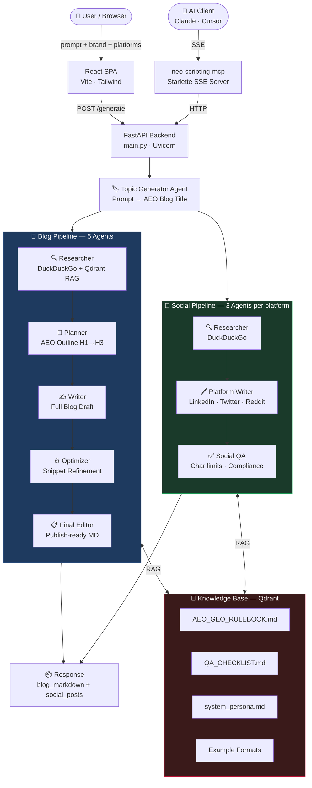

<div align="center">


</div>

<div align="center">

### ✦ From raw prompt → publish-ready blog + social content ✦
### Built to rank in AI answer engines. Designed to be cited by LLMs.

<br/>

[](https://python.org)
[](https://fastapi.tiangolo.com)
[](https://react.dev)
[](https://vitejs.dev)
[](https://tailwindcss.com)
[](https://ai.google.dev)
[](https://qdrant.tech)
[](https://docker.com)
[](https://vercel.com)
[](https://railway.app)
[](LICENSE)

</div>

---

## 🧠 What is Neo Scripting?

**Neo Scripting** is a multi-agent AI content engine built for the era of generative search. Drop in a raw topic prompt — get back a fully structured, **AEO/GEO-optimized** blog post in Markdown and platform-specific social posts for **LinkedIn, Twitter, and Reddit**, all in one API call.

> **AEO** (Answer Engine Optimization) = content structured to be surfaced in Google AI Overviews, featured snippets, and voice search.
> **GEO** (Generative Engine Optimization) = content formatted to be cited and referenced by LLMs like ChatGPT and Gemini.

Neo Scripting is not a wrapper around a single LLM. It's a **10-agent pipeline** with vector-backed knowledge retrieval, live web research, platform-aware social writers, and a built-in QA layer — all exposed over a clean REST API and an MCP server for AI client integration.

---

## ✨ Key Highlights

| Feature | Details |
|---|---|
| 🤖 **10 Specialized Agents** | Each agent has a single job — research, plan, write, optimize, QA, or publish |
| 📚 **RAG Knowledge Base** | Qdrant-powered vector DB with built-in AEO rulebook, QA checklist & examples |
| 🔍 **Live Web Research** | DuckDuckGo search baked into the Researcher agent pipeline |
| 🌐 **Multi-LLM Routing** | Gemini Flash (primary) · OpenAI · OpenRouter — per-agent model overrides |
| 📡 **MCP Server** | Plug directly into Claude, Cursor, or any MCP-compatible AI client |
| ⚡ **One API Call** | `POST /generate` → blog + all social posts in a single response |
| 🔭 **Observability** | Optional Langfuse tracing — token counts across full pipeline |
| 🚀 **Deploy Anywhere** | Vercel (backend + frontend) · Railway + Docker (MCP server) |

---

## 🏗️ Architecture



---

## 🤖 The 10 Agents

<div align="center">

| # | Agent | Role | Tools |
|---|---|---|---|
| 1 | 🏷️ **Topic Generator** | Converts raw prompt → precise AEO blog title | — |
| 2 | 🔍 **Researcher** *(Blog)* | Finds facts, stats & user questions | DuckDuckGo + Qdrant KB |
| 3 | 📐 **Planner** | Creates AEO outline (H1→H3, user Qs per section) | Qdrant KB |
| 4 | ✍️ **Writer** | Writes full blog from outline + research | Qdrant KB |
| 5 | ⚙️ **Optimizer** | Refines direct answers (<50 words), snippet potential | Qdrant KB |
| 6 | 📋 **Final Editor** | Publish-ready Markdown output | Qdrant KB |
| 7 | 🔍 **Researcher** *(Social)* | Platform-specific research pass | DuckDuckGo |
| 8 | 💼 **LinkedIn Writer** | Professional posts for LinkedIn | Qdrant KB |
| 9 | 🐦 **Twitter Writer** | 280-char tweets with hashtags | Qdrant KB |
| 10 | 👾 **Reddit Writer** | Conversational Reddit-style posts | Qdrant KB |
| ✅ | **Social QA** | Char limits + platform compliance check | — |

</div>

> All agents run on **`GeminiCompatOpenAIChat`** — a custom Agno wrapper that strips unsupported tool fields before hitting the Gemini API. The Researcher agent is always pinned to Gemini Flash for reliable tool-call behavior.

---

## 🗂️ Project Structure

```
Neo Scripting/
├── main.py                          ← FastAPI entry point
├── requirements.txt
├── vercel.json                      ← Serverless deployment config
├── .env.example
│
├── aeo_blog_engine/                 ← Core backend package
│   ├── agents.py                    ← All 10 agent definitions
│   ├── config/
│   │   └── settings.py              ← Env config + per-agent model routing
│   ├── pipeline/
│   │   └── blog_workflow.py         ← AEOBlogPipeline orchestrator
│   ├── knowledge/
│   │   ├── knowledge_base.py        ← Qdrant vector DB + embedder selection
│   │   ├── ingest.py                ← Document ingestion (.md/.txt/.pdf)
│   │   └── docs/                    ← Built-in knowledge base
│   │       ├── AEO_GEO_RULEBOOK.md
│   │       ├── QA_CHECKLIST.md
│   │       ├── prompts/system_persona.md
│   │       └── examples/            ← FAQ · long-form · snippet formats
│   └── tools/
│       └── custom_duckduckgo.py     ← Custom Agno toolkit
│
├── neo-scripting-frontend/          ← React SPA
│   └── src/
│       ├── App.jsx                  ← Router (/ and /result)
│       ├── pages/
│       │   ├── Home.jsx
│       │   └── Result.jsx
│       └── components/
│           ├── GeneratorForm.jsx    ← Main input form
│           ├── StepTracker.jsx      ← Pipeline progress indicator
│           ├── MarkdownViewer.jsx   ← Blog markdown renderer
│           └── SocialPostCard.jsx
│
└── neo-scripting-mcp/                ← MCP server
    ├── server.py                    ← Starlette SSE server
    ├── tools.py                     ← 3 MCP tool handlers
    ├── Dockerfile
    └── railway.toml
```

---

## 🛠️ Tech Stack

<div align="center">

### Backend
[](https://python.org)
[](https://fastapi.tiangolo.com)
[](https://docker.com)
[](https://cloud.google.com)

| Layer | Tech |
|---|---|
| Runtime | Python 3.x |
| Web Framework | FastAPI + Uvicorn |
| Agent Framework | Agno (multi-agent orchestration) |
| Primary LLM | Google Gemini Flash (OpenAI-compat endpoint) |
| Fallback LLMs | OpenAI · OpenRouter |
| Vector DB | Qdrant (cloud or local Docker) |
| Embeddings | text-embedding-3-small · text-embedding-3-large · text-embedding-004 (auto-selected) |
| Web Search | DuckDuckGo via custom Agno Toolkit |
| Observability | Langfuse (token tracking + traces) |
| Deployment | Vercel (serverless) |

### Frontend
[](https://react.dev)
[](https://vitejs.dev)
[](https://tailwindcss.com)

| Layer | Tech |
|---|---|
| Framework | React 18 |
| Build Tool | Vite 6 |
| Routing | React Router DOM v6 |
| Styling | Tailwind CSS v3 |
| Markdown | react-markdown + remark-gfm |
| Icons | lucide-react |
| Deployment | Vercel SPA |

### MCP Server
| Layer | Tech |
|---|---|
| Protocol | MCP ≥ 1.0.0 (SSE transport) |
| Web Framework | Starlette + Uvicorn |
| HTTP Client | httpx |
| Deployment | Docker on Railway |

</div>

---

## 🚀 Getting Started

### Prerequisites

- Python 3.x
- Node.js 18+
- Docker (for Qdrant)
- Google Gemini API key

---

### 1️⃣ Start Qdrant (Vector DB)

```bash
docker run -d -p 6333:6333 qdrant/qdrant
```

---

### 2️⃣ Clone & Configure

```bash
git clone https://github.com/your-org/neo-scripting.git
cd Neo Scripting

cp .env.example .env
```

Open `.env` and fill in the required keys:

```env
# ✅ Required
GEMINI_API_KEY=your_gemini_key
QDRANT_URL=http://localhost:6333
QDRANT_API_KEY=local

# ⚙️ Optional — LLM overrides
OPENAI_API_KEY=
OPENROUTER_API_KEY=
LLM_PROVIDER=google
MODEL_NAME=models/gemini-flash-latest

# 🔭 Optional — Observability
LANGFUSE_PUBLIC_KEY=
LANGFUSE_SECRET_KEY=
LANGFUSE_HOST=https://cloud.langfuse.com
```

---

### 3️⃣ Backend Setup

```bash
pip install -r requirements.txt

# Ingest built-in knowledge base into Qdrant (first time only)
python -m aeo_blog_engine.knowledge.ingest

# Start the API server
uvicorn main:app --host 0.0.0.0 --port 8000 --reload
```

✅ API is live at `http://localhost:8000`

---

### 4️⃣ Frontend Setup

```bash
cd neo-scripting-frontend
npm install

# Set your backend URL
echo "VITE_API_BASE_URL=http://localhost:8000" > .env.development

npm run dev
```

✅ Frontend is live at `http://localhost:5173`

---

### 5️⃣ MCP Server (Optional — for AI client integration)

Copy `neo-scripting-mcp/.env.example` to `neo-scripting-mcp/.env` and fill in your values.

```bash
cd neo-scripting-mcp
cp .env.example .env
pip install -r requirements.txt

uvicorn server:starlette_app --host 0.0.0.0 --port 8080
```

Or via Docker:

```bash
docker build -t neo-scripting-mcp .
docker run -e API_BASE_URL=http://localhost:8000 -p 8080:8080 neo-scripting-mcp
```

✅ MCP server ready at `http://localhost:8080/sse`

#### Railway Deployment

**Start command:** `uvicorn server:starlette_app --host 0.0.0.0 --port $PORT`

| Variable | Required | Notes |
|---|---|---|
| `API_BASE_URL` | Yes | Your Vercel backend URL (no trailing slash) |
| `PORT` | No | Injected automatically by Railway |
| `MCP_SECRET` | Yes (production) | Shared secret for `X-MCP-Secret` header auth |
| `LOG_LEVEL` | No | Default: `info` |

> `railway.toml` already has the explicit `startCommand` and health check config.

---

## 📡 API Reference

### `POST /generate`

Runs the full pipeline — blog + all social posts.

```json
// Request
{
  "prompt": "Why AI agents are replacing traditional SaaS workflows",
  "brand_name": "Teeny Tech Trek",
  "company_url": "https://teenytechtrek.com",
  "platforms": ["linkedin", "twitter", "reddit"]
}
```

```json
// Response
{
  "blog_markdown": "# Why AI Agents Are Replacing...\n\n...",
  "social_posts": {
    "linkedin": "AI agents aren't just tools anymore...",
    "twitter": "Traditional SaaS is getting disrupted 🧵...",
    "reddit": "Hot take: AI agents are eating SaaS..."
  }
}
```

### `POST /ingest`

Ingest a `.md`, `.txt`, or `.pdf` file into the Qdrant knowledge base.

### `GET /health`

Returns API status + live Qdrant connectivity check.

### `GET /`

Service info and version.

---

## 📡 MCP Tools

Connect any MCP-compatible AI client (Claude Desktop, Cursor, etc.) to `GET /sse`:

| Tool | What it does |
|---|---|
| `generate_blog` | Runs full pipeline → blog + social posts |
| `ingest_document` | Adds a file to the Qdrant knowledge base |
| `check_backend_health` | Reports API + Qdrant status |

---

## ☁️ Deployment

| Component | Platform | Config |
|---|---|---|
| Backend API | Vercel (serverless Python) | `vercel.json` → `api/index.py` |
| Frontend SPA | Vercel | `neo-scripting-frontend/vercel.json` |
| MCP Server | Railway (Docker) | `railway.toml` + `Dockerfile` |

---

## 🧩 Implementation Notes

<details>
<summary><b>🔧 Gemini OpenAI-compat endpoint</b></summary>

All agents communicate with Gemini via `https://generativelanguage.googleapis.com/v1beta/openai/` using an OpenAI-compatible interface. A custom `GeminiCompatOpenAIChat` class strips Agno-specific tool fields (`requires_confirmation`, `external_execution`) that Gemini rejects.

</details>

<details>
<summary><b>🔒 Researcher is always Gemini</b></summary>

`RESEARCHER_PROVIDER` is hardcoded to `"google"` — DuckDuckGo tool calls only work reliably with Gemini Flash in production testing.

</details>

<details>
<summary><b>🔄 Fallback research strategy</b></summary>

If the Researcher returns empty or garbage output (rate limits, quota exceeded), the pipeline retries once, then falls back to a deterministic structured response with KB snippets injected directly.

</details>

<details>
<summary><b>⚙️ Async pipeline execution</b></summary>

The Agno pipeline is synchronous. It runs inside `asyncio.get_event_loop().run_in_executor()` via a `ThreadPoolExecutor` to avoid blocking FastAPI's async event loop.

</details>

<details>
<summary><b>🧠 Embedder auto-selection</b></summary>

`auto` mode picks the first available embedder based on which API keys are set: **OpenAI → OpenRouter → Gemini**. Override with `EMBEDDER_PROVIDER`.

</details>

<details>
<summary><b>📊 Langfuse token tracking</b></summary>

Aggregates `input_tokens + output_tokens` across all agent responses in the full pipeline and logs a single generation record to Langfuse. Silent no-op if keys are absent.

</details>

<details>
<summary><b>🗂️ Topic is shared across pipelines</b></summary>

`/generate` calls `generate_topic_only()` once and passes the same topic string to both the blog pipeline and all social pipelines — preventing topic drift across outputs.

</details>

---

## 🌍 Environment Variables — Full Reference

<details>
<summary><b>View all variables</b></summary>

**Required**

| Variable | Description |
|---|---|
| `GEMINI_API_KEY` | Google Gemini API key |
| `QDRANT_URL` | Qdrant instance URL (`http://localhost:6333` or cloud) |
| `QDRANT_API_KEY` | Qdrant API key (`"local"` for Docker) |

**LLM Overrides (Optional)**

| Variable | Default | Description |
|---|---|---|
| `OPENAI_API_KEY` | — | OpenAI fallback + embeddings |
| `OPENROUTER_API_KEY` | — | OpenRouter fallback + embeddings |
| `LLM_PROVIDER` | `google` | Default provider for all agents |
| `MODEL_NAME` | `models/gemini-flash-latest` | Default model |
| `RESEARCHER_MODEL` | from `MODEL_NAME` | Override researcher model |
| `PLANNER_PROVIDER` / `PLANNER_MODEL` | from defaults | Override planner |
| `WRITER_PROVIDER` / `WRITER_MODEL` | from defaults | Override writer |
| `OPTIMIZER_PROVIDER` / `OPTIMIZER_MODEL` | from defaults | Override optimizer |
| `QA_PROVIDER` / `QA_MODEL` | from defaults | Override QA |

**Knowledge Base (Optional)**

| Variable | Default |
|---|---|
| `COLLECTION_NAME` | `aeo_knowledge_base` |
| `EMBEDDER_PROVIDER` | `auto` (openai → openrouter → gemini) |

**Observability (Optional)**

| Variable | Description |
|---|---|
| `LANGFUSE_PUBLIC_KEY` | Langfuse tracing |
| `LANGFUSE_SECRET_KEY` | Langfuse tracing |
| `LANGFUSE_HOST` | Default: `https://cloud.langfuse.com` |

**MCP Server Only**

| Variable | Description |
|---|---|
| `API_BASE_URL` | FastAPI backend URL (required) |
| `PORT` | MCP server port (default `8080`) |
| `LOG_LEVEL` | Logging level (default `info`) |

**Frontend**

| Variable | Description |
|---|---|
| `VITE_API_BASE_URL` | FastAPI backend URL (default `http://localhost:8000`) |

</details>

---

<div align="center">


**Built by Krishna**

*Build small. Launch fast. Scale smart.*

</div>
